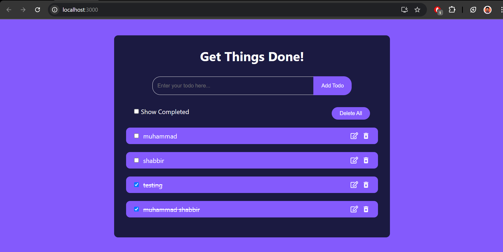

# 📝 Todo List App

This is a simple **React-based Todo List Application** where you can add, update, delete, and filter tasks based on completion status. Keep track of your daily tasks and get things done!

## 🚀 Features

- Add new tasks 📥
- Mark tasks as completed ✅
- Edit tasks 📝
- Delete individual tasks ❌
- Delete all tasks 🗑️
- Filter by completed tasks 🔄

## 🛠️ Technologies Used

- **React.js** ⚛️
- **JavaScript (ES6+)** 💻
- **CSS** 🎨

## 📦 How to Run the Project

1. Clone the repository:

```bash
git clone https://github.com/codewithshabbir/Learning.git
cd Learning/ReactJs/Mini\ Projects/todo-list
```

2. Install dependencies:

```bash
npm install
```

3. Start the development server:

```bash
npm start
```

4. Open your browser and navigate to `http://localhost:3000`

## 📸 Preview



## 🌟 Contributing

Feel free to contribute and make this project better! Fork the repository and submit a pull request.

## 👨‍💻 Author

- **Muhammad Shabbir**  
  - [GitHub](https://github.com/codewithshabbir)
  - [LinkedIn](https://www.linkedin.com/in/codewithshabbir)
  - [CodePen](https://codepen.io/codewithshabbir)
  - [Instagram](https://www.instagram.com/codewithshabbir)
  - [Facebook](https://www.facebook.com/codewithshabbir)

## 📞 Contact

For any inquiries or feedback, feel free to reach out at:
- **Email**: [muhammadshabbir4589@gmail.com](mailto:muhammadshabbir4589@gmail.com)

## 📢 Hashtags
#React #JavaScript #TodoList #WebDevelopment #Frontend #CSS #HTML #WebApp #ReactJS #Project #Coding #Programming #Developer #OpenSource #Tech #GitHub #Application #Productivity #ToDo #SoftwareDevelopment